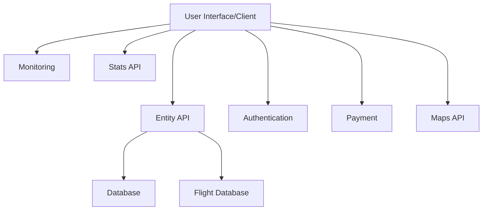
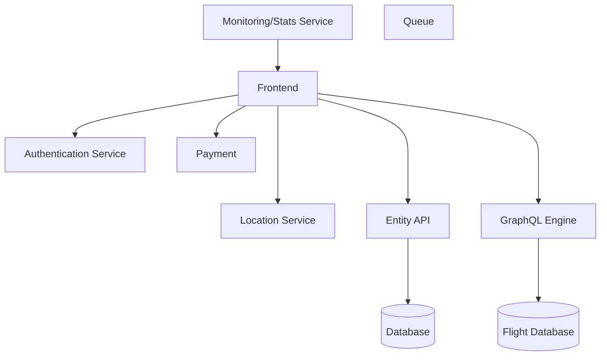

# Fly Radar

## Навигация

## Описание проекта

Приложение для онлайн мониторинга перемещения самолетовю. Контроль за их полетами осуществляют авиадиспетчеры аэропортов. Простым же пользователям достаточно убедиться в успешном перемещении самолета. Это основная цель данного приложения.

## Принцип работы
1) Воздушное судно определяет свое местоположение с помощью GPS-навигатора.
2) Борт, оборудованный транспондером, передает в эфир сообщения, в которых содержатся все данные о нем. 
3) Сообщения генерируются каждую секунду, что позволяет создавать исчерпывающую онлайн картину его перемещения.
4) Наземный приемник принимает все данные и передает их на сервер онлайн-радара.
5) На веб-сайте сервиса составляется карта полетов самолетов в реальном времени, которая доступна для общего пользования.

_Note: я взял за константу, что у меня есть БД с уже готовыми данными о каждом борте, обновляющуюся каждую секунду._

## Значимые функционалные и не функциональные требования

**Функционльные:**

- Отображение на карте местоположения всех доступных самолетов
- Возомжность следить за конкретным рейсом (по модели самолета или по уникальному идентификтору)
- Давать полную информацию о борте (всю что можно достать)
- Корректно и быстро работать в независимости от местоположения поользователя
- Неравномерная нагрузка - кол-во пользвателей будет различным чуть ли не каждый день, и их локация тоже

- Предсказуемость
- Прозрачность 
- Нахохождение неисправностей
- Масштабируемость
- Защита пользовательский данных

**Не функциональные**

- Сервис дает базовый функционал без регистрации и бесплатно
- *Поддержка нескольких языков
- Для профессионалов радары могут предоставлять коммерческую и узкоспециальную информацию. Чаще всего, это статистические или исторические данные, а также интеграция сервисов в компании
- Интерфесй должен быть понятен интуитивно

## Технические и не технические ограничения

**Технические**

- Отслеживание с помощью радаров возможно только в том случае, если борт оснащен транспондером — передающим устройством типа ADS-B, находящимся в активном состоянии. Данная штука ставиться в основном на гражданские суда, следовательно гос. авиация и нектороые транспортные суда не могут быть отслеживаемыми
- Примники ADS-B должны нахходиться по всей планете у каждого из них радиус - 200-400км

**Не технические**

- Пользователь должен иметь стабильное интернет соединение

## Решения и последствия

1) Использование готовых решений в приложении:
 - Время разработки значительно сокращается ибо команде не нужно тратить время на написание и продумывание гибких сервисов.
 - Необходим высокий уровень разработчика что придется учитывать
 - Расширяемость фич - если тебе нужно запилить фичу которой нет в готовом решении придется туго

2) Испеользование SSO (Single Sign On)
- Упрощает регистрацию пользователей, по скольку нам не нужны специфические данные о пользовтеле проще использовать их существующие акканту соц. провайдеров
- Снимает ответственность за хранение пользовательский данных
- Нет воможности взять данные которых не предоствляет соц провайдер
- Возможность зайти пользователю сразу с нескольких соц провайдеров приведет к тому что придется решать вопросы с слиянием аккаунтов (Когда ты зарегался с гугла, а потом с гитхаба)

3) Использование Amazon Location Service
- Решение позволяет не париться по поводу всего, что связано с картами. Есть возможность отображение местоположений трекинга и так далее.
- Платно =(
- Возможно потребуется использовать сразу нескольк aws сервисов для корректной работы

4) Использование бессерверных вычислений
- Достаточно удобны т.к. данные в базе будут меняться примерно каждую секунду и нам эти изменнения нужно будет обрабатывать.
- Если использовать aws Lambda, то будет удобно платить за вычисления.
- Сложность реализации
- Возможно это будет дорого

5) Использование GraphQL
- Можно подтягивать именно те данные которые необзодимы фронтенду именно в данный момент времени. Обычно когда пользуешься сервисом ты перемещаешься по карте и конфигурации запроса будет тоже менятся

- Простота реализации, есть уже готовые решения, которыми я пользовался которые позволяют развернуть базу с GraphQL engine в считанные часы

6) Использование Push уведомлений
- Пользователь получает новые данные как тольк они появились на сервере
- Необходимо подписка по определенной конфигурации которая будет постоянно менятся когда пользователь двигает карту или еще чего

## Доставка конфигурации в приложение

- Для хранения секретов думаю классно использовать Vault перенести, выделить такой сервис на хранение ключей к БД или закрытым апи ключам достаточно неплохо

- Для доставки конфигурации мы использовали Argo - найс система по реализации CD. 

_Note: думаю тут я еще подумаю над решениями._

## Декомпозиция

Я еще не все решил с архитекторой поэтому, думаю пока что это набросок того как я вижу картину. После некоторых обсуждений думаю можно порешать что-то куда интереснее.

### Логическая схема

CDN - ??? 
Queue - ???

### Схема сервисов

## Тип архитектуры

Я бы выбрал Микросервисную архитектуру:
Главной причиной я бы назвал то, что запросы о местоположении самолетов по параметрам будут в 1000-и раз больше чем любые другие, данную нагрузку лучше выделить в отдельный сервис.

Есть еще вариант с бессерверной архитектурой, но я недостаточно осведомлен о ней, чтобы четко выявить плюсы и недостатки подхода, хотя со средствами Амазон звучит хайпово.
Например: Использовать Amazon location service --> Lambda раз в секунда считывает информации о ней и состовляет Query --> Другая Lamda делает запрос в БД --> SNS пушит новые данные в на устройство --> Строиться новое представление.
Но я вообще не уверен в его жизнеспособности 

## Очередь

## База данных
